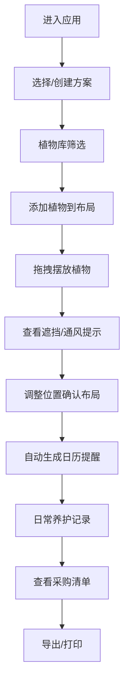

## 1. 产品概述
阳台种植规划工具是一款面向家庭园艺爱好者的纯前端Web应用，帮助用户系统化规划阳台空间、选择合适植物、管理养护日程并跟踪采购需求。
- 解决阳台空间利用不科学、植物选择盲目、养护记

## 2. 核心功能

### 2.1 用户角色
| 角色 | 注册方式 | 核心权限 |
|------|---------|---------|
| 园艺爱好者 | 无需注册，本地存储 | 创建和管理种植方案 |

### 2.2 功能模块
1. **植物库**：植物筛选（光照/季节/花盆尺寸）、植物详情展示
2. **空间布局**：阳台平面图、拖拽摆放、遮挡/通风智能提示
3. **种植日历**：播种/换盆/施肥/修剪/收获提醒、月历视图
4. **养护记录**：浇水记录、病虫害记录、长势照片、处理结果追踪
5. **采购清单**：土壤/肥料/支架/种子汇总、已买/缺货/替代品标记
6. **方案管理**：多方案本地存储、方案切换/重命名/删除
7. **导出功能**：布局图导出图片、养护表打印

### 2.3 页面详情
| 页面名称 | 模块名称 | 功能描述 |
|---------|---------|---------|
| 主应用（单页） | 顶部导航栏 | 方案切换、新建方案、重命名、导出、打印入口 |
| 主应用 | 侧边标签栏 | 五大模块切换标签：植物库、空间布局、种植日历、养护记录、采购清单 |
| 植物库 | 筛选面板 | 光照条件筛选（全日照/半日照/耐阴）、季节筛选（春/夏/秋/冬/四季）、花盆尺寸筛选（小/中/大）、搜索框 |
| 植物库 | 植物列表 | 卡片式展示植物图片、名称、特性标签、添加到布局按钮 |
| 植物库 | 植物详情弹窗 | 生长周期、养护要点、病虫害防治、适宜季节、浇水频率 |
| 空间布局 | 阳台画布 | 可配置尺寸的阳台平面图、网格辅助线 |
| 空间布局 | 植物拖拽区 | 从植物库添加的植物列表、可拖拽到画布 |
| 空间布局 | 智能提示 | 遮挡警告（植物高度叠加）、通风提示（间距不足）、光照分析（位置与窗户距离） |
| 空间布局 | 属性面板 | 选中植物的位置、花盆大小调整、删除 |
| 种植日历 | 月历视图 | 当月日历网格、事件标记颜色区分类型 |
| 种植日历 | 事件列表 | 当天所有提醒事件列表、完成/未完成状态切换 |
| 种植日历 | 事件详情 | 提醒类型、关联植物、操作指南 |
| 养护记录 | 记录时间轴 | 按时间倒序展示养护记录 |
| 养护记录 | 新建记录表单 | 记录类型选择（浇水/施肥/修剪/病虫害/其他）、关联植物、照片上传、备注、处理结果 |
| 养护记录 | 照片墙 | 植物长势照片展示 |
| 采购清单 | 分类汇总表 | 按土壤/肥料/种子/工具/其他分类展示采购项 |
| 采购清单 | 状态管理 | 勾选已买、标记缺货、添加替代品备注 |
| 采购清单 | 手动添加 | 手动添加自定义采购项 |
| 方案管理 | 方案列表 | 弹窗展示所有保存的方案列表 |
| 方案管理 | 操作按钮 | 新建/切换/重命名/删除方案 |

## 3. 核心流程
用户首次进入应用 → 创建或选择一个方案 → 从植物库筛选适合的植物 → 拖拽植物到阳台布局 → 查看智能提示调整位置 → 自动生成种植日历提醒 → 日常添加养护记录 → 查看采购清单准备物资 → 导出布局图或打印养护表

## 4. 用户界面设计

### 4.1 设计风格
- 主色调：自然绿色系（#2D6A4F 深翠绿）、暖米色背景（#FEFAE0）
- 辅助色：泥土棕（#BC6C25）、天空蓝（#60A5FA）
- 按钮风格：圆角胶囊形、轻微阴影、悬停上浮动画
- 字体：标题使用「思源宋体/Serif用于主标题，正文使用系统无衬线字体
- 布局：卡片式布局、柔和阴影、自然纹理背景装饰
- 图标：植物、植物/

### 4.2 页面设计
| 页面名称 | 模块名称 | UI元素 |
|---------|---------|---------|
| 主应用 | 导航栏 | 左侧Logo+方案名、右侧操作按钮组 |
| 主应用 | 侧边标签栏 | 竖向图标+文字标签、选中高亮 |
| 植物库 | 筛选面板 | 标签式筛选器、搜索输入框 |
| 植物库 | 植物卡片 | 植物emoji图标、名称、特性标签悬浮效果 |
| 空间布局 | 画布区 | 网格背景、窗户标记、植物图标可拖拽 |
| 空间布局 | 提示浮层 | 红色警告/黄色提示气泡 |
| 种植日历 | 月历 | 日期格子、事件点颜色标记 |
| 养护记录 | 时间轴 | 竖线时间轴、卡片式记录 |
| 采购清单 | 表格 | 分类标题、勾选框、状态标签 |

### 4.3 响应式
- 桌面端优先设计（≥1024px）
- 平板端（768-1024px）：侧边标签改为顶部横向标签
- 移动端（<768px）：单列布局、抽屉式菜单

### 4.4 动效设计
- 页面加载：各模块渐入+轻微上移动画
- 拖拽植物：半透明跟随、放置缩放回弹
- 悬停卡片：轻微上浮+阴影加深
- 切换标签：内容区淡入淡出过渡
- 日历事件：点击弹跳效果
