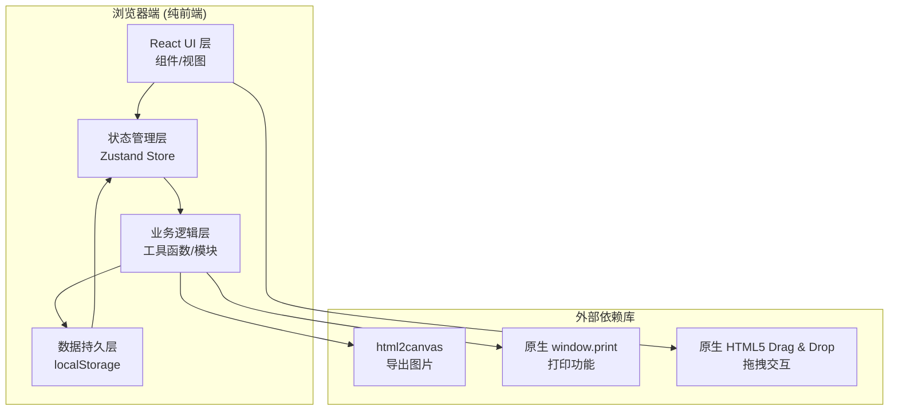
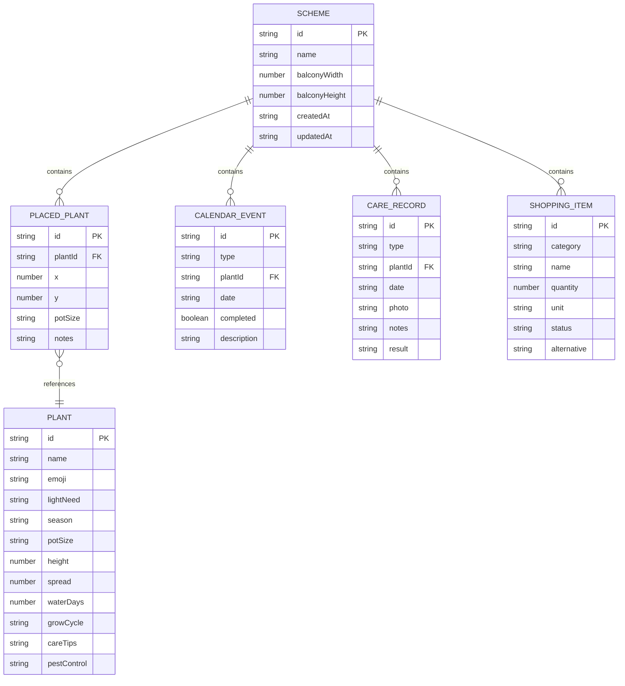

## 1. 架构设计



## 2. 技术说明

- **前端框架**: React@18 + TypeScript@5 + Vite@5
- **样式方案**: Tailwind CSS@3 + 自定义 CSS 变量主题
- **状态管理**: Zustand@4 (轻量级状态管理)
- **导出功能**: html2canvas (Canvas 截图导出 PNG)
- **打印功能**: 原生 window.print() + 专用打印样式
- **数据存储**: localStorage (JSON 序列化，多方案隔离)
- **图标方案**: 原生 Emoji + Lucide React@0.344

## 3. 路由定义

本项目为单页应用(SPA)，使用模块内切换而非路由：

| 模块标识 | 模块名称 | 说明 |
|---------|---------|------|
| library | 植物库 | 植物筛选与详情展示 |
| layout | 空间布局 | 拖拽布局与智能提示 |
| calendar | 种植日历 | 月历视图与养护提醒 |
| records | 养护记录 | 时间轴与记录管理 |
| shopping | 采购清单 | 物资汇总与状态管理 |

## 4. 数据模型

### 4.1 实体关系图



### 4.2 数据结构详情

```typescript
// 植物数据
interface Plant {
  id: string;
  name: string;
  emoji: string;
  lightNeed: 'full-sun' | 'partial-sun' | 'shade';
  season: ('spring' | 'summer' | 'autumn' | 'winter' | 'all')[];
  potSize: 'small' | 'medium' | 'large';
  height: number;       // 成熟高度 cm
  spread: number;       // 冠幅 cm
  waterDays: number;    // 浇水间隔天数
  growCycle: string;    // 生长周期描述
  careTips: string;     // 养护要点
  pestControl: string;  // 病虫害防治
  fertilizerNeed: string; // 肥料需求
  supportNeed: boolean; // 是否需要支架
  soilType: string;     // 土壤类型
}

// 摆放植物
interface PlacedPlant {
  id: string;
  plantId: string;
  x: number;
  y: number;
  potSize: 'small' | 'medium' | 'large';
  notes?: string;
}

// 日历事件
type CalendarEventType = 'sow' | 'repot' | 'fertilize' | 'prune' | 'harvest' | 'water';

interface CalendarEvent {
  id: string;
  type: CalendarEventType;
  plantId: string;
  date: string; // YYYY-MM-DD
  completed: boolean;
  description: string;
}

// 养护记录
type CareRecordType = 'water' | 'fertilize' | 'prune' | 'pest' | 'other';

interface CareRecord {
  id: string;
  type: CareRecordType;
  plantId: string;
  date: string;
  photo?: string; // base64
  notes: string;
  result?: string;
}

// 采购项
type ShoppingCategory = 'soil' | 'fertilizer' | 'seed' | 'tool' | 'support' | 'other';
type ShoppingStatus = 'pending' | 'bought' | 'out-of-stock';

interface ShoppingItem {
  id: string;
  category: ShoppingCategory;
  name: string;
  quantity: number;
  unit: string;
  status: ShoppingStatus;
  alternative?: string;
}

// 方案
interface Scheme {
  id: string;
  name: string;
  balconyWidth: number;   // cm
  balconyHeight: number;  // cm
  placedPlants: PlacedPlant[];
  calendarEvents: CalendarEvent[];
  careRecords: CareRecord[];
  shoppingItems: ShoppingItem[];
  createdAt: string;
  updatedAt: string;
}

// 全局应用状态
interface AppState {
  schemes: Scheme[];
  currentSchemeId: string | null;
  activeModule: ModuleKey;
}
```

## 5. 模块目录结构

```
src/
├── assets/              # 静态资源
├── data/
│   └── plants.ts        # 内置植物库数据 (约30种常见阳台植物)
├── store/
│   └── useStore.ts      # Zustand 全局状态管理
├── types/
│   └── index.ts         # TypeScript 类型定义
├── utils/
│   ├── storage.ts       # localStorage 工具
│   ├── calendar.ts      # 日历事件生成
│   ├── layout.ts        # 布局算法(遮挡/通风检测)
│   ├── shopping.ts      # 采购清单生成
│   └── export.ts        # 导出/打印工具
├── components/
│   ├── layout/
│   │   ├── Header.tsx
│   │   └── Sidebar.tsx
│   ├── library/
│   │   ├── PlantFilters.tsx
│   │   ├── PlantCard.tsx
│   │   └── PlantDetailModal.tsx
│   ├── layout-editor/
│   │   ├── BalconyCanvas.tsx
│   │   ├── DraggablePlant.tsx
│   │   ├── LayoutWarnings.tsx
│   │   └── PlantPropertyPanel.tsx
│   ├── calendar/
│   │   ├── MonthCalendar.tsx
│   │   ├── EventCard.tsx
│   │   └── EventListPanel.tsx
│   ├── records/
│   │   ├── CareTimeline.tsx
│   │   ├── RecordCard.tsx
│   │   └── AddRecordModal.tsx
│   ├── shopping/
│   │   ├── ShoppingCategory.tsx
│   │   └── ShoppingItemRow.tsx
│   └── common/
│       ├── Modal.tsx
│       ├── Button.tsx
│       └── SchemeManager.tsx
├── modules/
│   ├── PlantLibrary.tsx
│   ├── SpaceLayout.tsx
│   ├── PlantCalendar.tsx
│   ├── CareRecords.tsx
│   └── ShoppingList.tsx
├── App.tsx
├── main.tsx
└── index.css
```

## 6. 关键算法

### 6.1 布局智能检测
- **遮挡检测**: 计算植物冠幅 (spread) 圆域是否重叠，结合成熟高度判断是否形成光照遮挡
- **通风检测**: 植物间距小于冠幅平均值的60%时触发通风警告
- **光照分析**: 根据与窗户（默认画布上方/左侧边缘）距离、植物高度计算相对光照指数

### 6.2 日历事件自动生成
- 基于植物生长周期和当前日期，推算播种、换盆、施肥周期
- 施肥: 生长季每2-4周一次，按植物类型调整
- 浇水: 按 waterDays 自动生成循环提醒（可手动记录覆盖）

### 6.3 采购清单汇总
- 土壤: 按花盆大小 × 数量 × 填充比计算体积
- 肥料: 按植物需肥类型汇总
- 种子: 未摆放但已添加到列表的植物种子
- 支架: supportNeed = true 的植物数量
